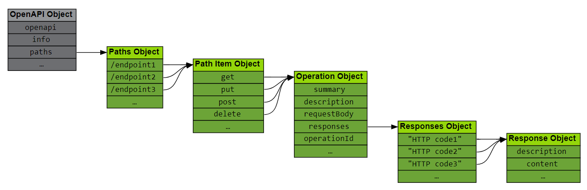

# OpenAPI
Estándar de descripción de APIs (2010)


## Índice
1. [Objetos de OpenAPI](#objetos-de-openapi)
    - [OpenAPI Object](#openapi-object)
    - [Path Object](#path-object)
    - [Path Item Object](#path-item-object)
    - [Responses Object](#responses-object)
    - [Parameter Object](#parameter-object)
    - [RequestBody Object](#requestbody-object)
2. [Ventajas de OpenAPI](#ventajas-de-openapi)


## Objetos de OpenAPI

### OpenAPI Object
```yaml
openapi: 3.1.0
info:
  title: Un documento básico de OpenAPI
  version: 0.0.1
  description: Ejempo de como hacer una API con OpenAPI
paths: {} # Aquí se definen os endpoints
```

- openapi (string): versión de OAS. Requerido.
- info (info object): información general:
    + title (string ). Requerido
    + version (string ). Requerido
    + description (string)
- paths (Path Object):
    + Descripción de los endpoints
    + Información de parámetros y respuestas
    
También podemos definir:
- `servers`: Array de Server Objects que indican la ruta.
- `webhooks`: información de los webhooks.
- `security`: informaicón sobre los mecanismos de seguridad.
- `components`: Definir schemas u parámetros y otros elementos para reutilizar en el documento. 

```yaml
openapi: 3.1.0
info:
  title: API de Ejemplo
  version: 1.0.0
  description: Una API de ejemplo con servers.

servers:
  - url: https://api.ejemplo.com/v1
    description: Servidor de producción
  - url: https://sandbox.api.ejemplo.com/v1
    description: Servidor de pruebas
```

### Path Object
- Puede contener un template entre `{` y `}`.
  + Tiene que estar definido después `/books/{id}`
  + No puede haber dos templated paths con la misma jerarquía, aunque tengan distintos nombres
  `/books/{id}` y `/books/{ref}``
- Contiene un Path Item Object

```yaml
paths:
  /books/{id}: ### Path Object
    get:       # Path Item Object
      ...
```

### Path Item Object
- Métodos soportados: GET, PUT, POST, DELETE, ...
- Contiene un Operation Object:
  + `summary`
  + `description`
  + `parameters`(Parameter Object): Lista de parámetros
  + `requestBody`(Request Body Object)
  + `responses` (Responses Object): Lista de posibles respuestas, al menos tiene que haber una y debería ser la de éxito.

```yaml
paths:
  /books/{id}:  ### Path Object
    get:        ### Path Item Object
      summary: Obtener un libro por ID ### Operation Object
      description: Devuelve los detalles de un libro específico
      parameters: # PARAMETERS
        - name: id
          in: path
          required: true
          description: ID del libro
          schema:
            type: string
      responses: ### Response Object
        '200':
          description: Libro encontrado
          content:
            application/json:
              schema:
                $ref: '#/components/schemas/Libro'
        '404': ### Response Object
          description: Libro no encontrado

  /books:       ### Path Object
    post:       ### Path Item Object > Operation Object
      summary: Crear un nuevo libro
      description: Añade un nuevo libro al catálogo
      requestBody: # REQUEST BODY
        required: true
        content:
          application/json:
            schema:
              $ref: '#/components/schemas/Libro'
      responses:
        '201':
          description: Libro creado correctamente
        '400':
          description: Datos inválidos

components:
  schemas:
    Libro:
      type: object
      properties:
        id:
          type: string
          example: "123abc"
        titulo:
          type: string
          example: "Cien años de soledad"
        autor:
          type: string
          example: "Gabriel García Márquez"
      required:
        - titulo
        - id
```
### Responses Object - Todas las respuestas
- Código de HHTP
- Entre comillas
- Se pueden usar placeholders: "5XX", "1XX", "2XX", ...
- Contiene un Response Object:
  + `description`(string) Required
  + `content`(media map) Listado de Media Types

  ```yaml
  responses:
    '200':
      description: Libro encontrado
      content:                       # ← Media Map
        application/json:           # ← Media Type Object
          schema:                   # ← Schema Object
            type: object
            properties:             # ← Properties Map
              id:
                type: string
              titulo:
                type: string
              autor:
                type: string
  ```

### Parameter Object
- `name`: Único en cada localización. Required.
- `in`: Localización del parámetro (path, query, header o cookie). Required.
- `description`
- `required` (boolean): False por defecto. Required para los path parameters que tienen que ser true.
- `style`: Como se va a serializar el parámetro (por defecto viene uno)
- `explode` (boolean):define cómo se desglosa (serializa) un parámetro complejo como un array u objeto en la URL (o header, cookie...). Su comportamiento depende del estilo (style) y del tipo de dato.

  ```yaml
  parameters:
    - name: id
      in: path        # <-- Path
      description: ID del libro
      required: true
      style: simple      # por defecto en path
      explode: false
      schema:
        type: string
  ```
    
  ```yaml
  parameters:
    - name: categorias
    in: query         # <-- Query
      description: Filtrar libros por categorías
      required: false
      style: form        # por defecto en query
      explode: true
      schema:
        type: array
        items:
          type: string
  ```

**Tabla de estilos `style` según `in`**

| `in`     | `style`       | Descripción / Ejemplo                                       |
|----------|----------------|-------------------------------------------------------------|
| `path`   | `simple`       | `/books/1,2,3` (sin nombre, valores separados por coma)     |
| `query`  | `form`         | `?id=1&id=2` (si `explode: true`)                          |
| `query`  | `spaceDelimited` | `?id=1%202%203` (valores separados por espacio)           |
| `query`  | `pipeDelimited`  | `?id=1|2|3` (valores separados por `|`)                   |
| `header` | `simple`       | `X-Custom: 1,2,3`                                           |
| `cookie` | `form`         | `id=1&id=2` (igual que query con `form`)                   |
 
**Tabla de explode** 
| Tipo      | explode: true                | explode: false               |
|-----------|------------------------------|------------------------------|
| Array     | `?id=1&id=2&id=3`            | `?id=1,2,3`                  |
| Objeto    | `?color=rojo&size=M`         | `?color,rojo,size,M` (según style) |

### RequestBody Object
Se utiliza para definir el **cuerpo de la petición** (por ejemplo, en POST o PUT).

- `required` (boolean): Indica si el cuerpo es obligatorio. Por defecto es `false`.
- `content`: **Media Map**, donde la clave es el tipo MIME (`application/json`, `text/plain`, etc.) y el valor es un **Media Type Object**.
  - Dentro del Media Type Object, se define un `schema` (Schema Object) que describe la forma del cuerpo esperado.
  
```yaml
requestBody:
  required: true
  content:
    application/json:
      schema:
        $ref: '#/components/schemas/Libro'
```

**Esquema referenciado (`Libro`)**

```yaml
components:
  schemas:
    Libro:
      type: object
      properties:
        id:
          type: string
        titulo:
          type: string
        autor:
          type: string
      required:
        - titulo
        - id
```

Este ejemplo indica que el cuerpo debe enviarse en formato JSON y contener al menos `titulo` e `id`.

## Ventajas de OpenAPI
- Validación de descripción y **Linting**-.
  + El archivo de descripción es sintácticamente correcto.
  + Se adhiere a una versión específica de la especificación.
  + Sigue las pautas de formato del equipo.
- Validación de datos.
  + Los datos que fluyen a través de la API son correctos.
  + Durante el desarrollo y una vez desplegados.
- Generación de la información.
- Generación de código.
- Editores gráficos.
  + Creación de archivos de descripción usando una interfaz gráfica.
- Servidores Mock.
- Análisis de seguridad.