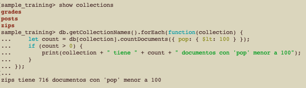
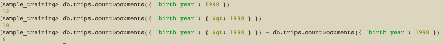
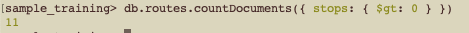
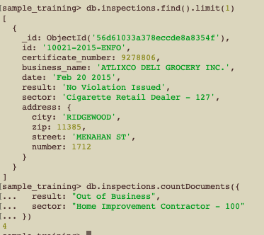
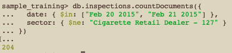

# Ejercicio 1 de MongoDB Tema 4

1. ¿Cuántas colecciones tienen menos de 100 personas en el campo pop?
```bash
db.getCollectionNames().forEach(function(collection) {
    let count = db[collection].countDocuments({ pop: { $lt: 100 } });
    if (count > 0) {
        print(collection + " tiene " + count + " documentos con 'pop' menor a 100");
    }
});
```

Sólo Zip tiene documentos con 'pop' menor a 100.

2. En sample_training.trips ¿Cuál es la diferencia entre la gente que nació en 1998 y la que nació después de 1998?
Primero tenemos que analizar el schema del documento:
```bash
sample_training> db.trips.find().limit(1)
... 
[
  {
    _id: ObjectId('572bb8222b288919b68abf5b'),
    tripduration: 889,
    'start station id': 268,
    'start station name': 'Howard St & Centre St',
    'end station id': 3002,
    'end station name': 'South End Ave & Liberty St',
    bikeid: 22794,
    usertype: 'Subscriber',
    'birth year': 1961,
    gender: 2,
    'start station location': { type: 'Point', coordinates: [ -73.99973337, 40.71910537 ] },
    'end station location': { type: 'Point', coordinates: [ -74.015756, 40.711512 ] },
    'start time': ISODate('2016-01-01T00:01:06.000Z'),
    'stop time': ISODate('2016-01-01T00:15:56.000Z')
  }
]
```


Primero contamos el número de personas nacidas después de 1998 `db.trips.countDocuments({ 'birth year': { $gt: 1998 } })`(`$gt`es mayor que)
Después le restamos el número de personas nacidas en 1998 `db.trips.countDocuments({ 'birth year': 1998 })`

3. en sample_training.routes ¿Cuántas rutas tienen al menos una parada?
Estructura:
```bash
sample_training> db.routes.find().limit(1)
[
  {
    _id: ObjectId('56e9b39b732b6122f877fa32'),
    airline: { id: 410, name: 'Aerocondor', alias: '2B', iata: 'ARD' },
    src_airport: 'ASF',
    dst_airport: 'KZN',
    codeshare: '',
    stops: 0,
    airplane: 'CR2'
  }
]
```

4. ¿Cuántos negocios tienen un resultado de inspección "Out of Business" y pertenecen al sector "Home Improvement Contractor - 100"?

5. En sample_training.inspections ¿Cuántos documentos hay con fecha de inspeccción "Feb 20 2015" o "Feb 21 2015" y cuyo sector no sea "Cigarette Retail Dealer - 127"?
