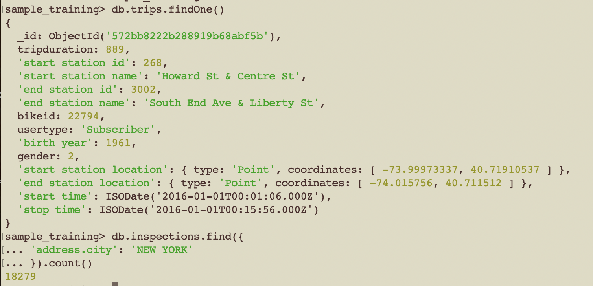

# Ejercicio 2 de MongoDB Tema 4

1. En `sample_training.companies`, ¿cuántas empresas tienen más empleados que el año en el que se fundaron? (sol. 324)

2. En `sample_training.companies`, ¿en cuántas empresas coinciden su `permalink` con su `twitter_username`? (sol. 1299)

3. En `sample_airbnb.listingsAndReviews`, ¿cuál es el nombre del alojamiento en el que pueden estar más de 6 personas alojadas y tiene exactamente 50 reviews? (sol. Sunset Beach Lodge Retreat)

4. En `sample_airbnb.listingsAndReviews`, ¿cuántos documentos tienen el `"property_type"` "House" e incluyen `"Changing table"` como una de las `"amenities"`? (sol. 11)

5. En `sample_training.companies`, ¿cuántas empresas tienen oficinas en Seattle? (sol. 117)

6. En `sample_training.companies`, haga una query que devuelva únicamente el nombre de las empresas que tengan exactamente 8 `"funding_rounds"`

7. En `sample_training.trips`, ¿cuántos viajes empiezan en estaciones que están al oeste de la longitud -74? (sol. 1928)  
   Nota 1: Hacia el oeste la longitud decrece  
   Nota 2: el formato es `<field_name>: [ <longitud>, <latitud> ]`

8. En `sample_training.inspections`, ¿cuántas inspecciones se llevaron a cabo en la ciudad de `"NEW YORK"`? (sol. 18279)

9. En `sample_airbnb.listingsAndReviews`, haga una query que devuelva el nombre y la dirección de los alojamientos que tengan `"Internet"` como primer elemento de `"amenities"`

