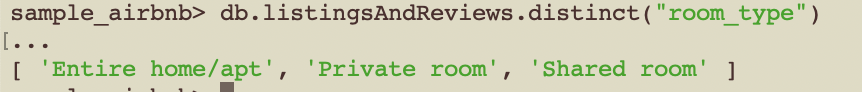
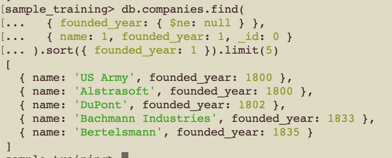
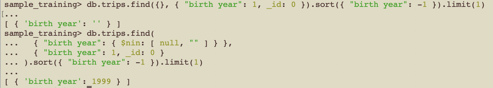

# MongoDB – EJ3

1. En `sample_airbnb.listingsAndReviews`, ¿qué "room types" existen?  

2. En `sample_training.companies`, haga una query que devuelva el nombre y el año en el que se fundaron las 5 compañías más antiguas.  

3. En `sample_training.trips`, ¿en qué año nació el ciclista más joven? (sol. 1999)

    Nota: Usamos `$nin: [null, ""]` para excluir tanto los valores null como los strings vacíos (""), asegurando que solo se consideren documentos con un valor válido en "birth year"