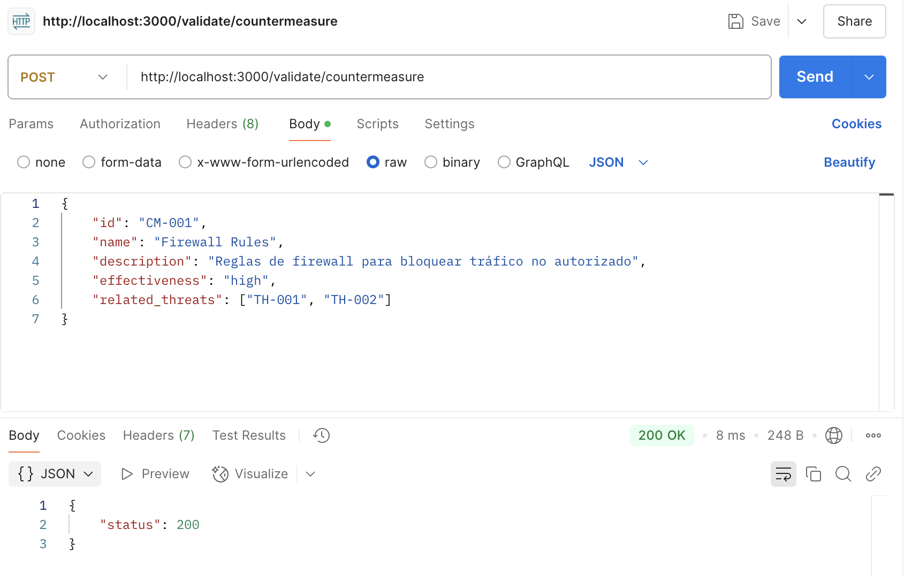

# Validador con ajv

**Ejecutar el servidor:**  
```sh
node index.js
```

## Validar una amenaza (`/validate/threat`) 
- **Ejemplo de JSON válido:**  
```json
{
    "cve": "CVE-2023-12345",
    "name": "SQL Injection",
    "description": "Vulnerabilidad que permite inyección de SQL",
    "countermeasures": ["CM-001"],
    "severity": "critical"
}
```

## Validar una contramedida (`/validate/countermeasure`)
- **Ejemplo de JSON válido:**  
```json
{
    "id": "CM-001",
    "name": "Firewall Rules",
    "description": "Reglas de firewall para bloquear tráfico no autorizado",
    "effectiveness": "high",
    "related_threats": ["TH-001", "TH-002"]
}
```

---

## ✅ **Ejemplo de validación exitosa**  

**Cuando el JSON es válido:**  



---

## ❌ **Ejemplo de error en la validación**  

**Cuando el JSON es inválido:**  


---
