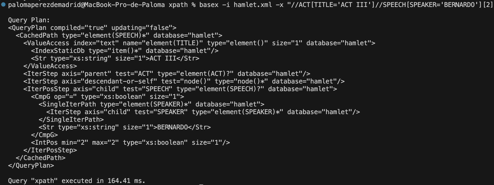
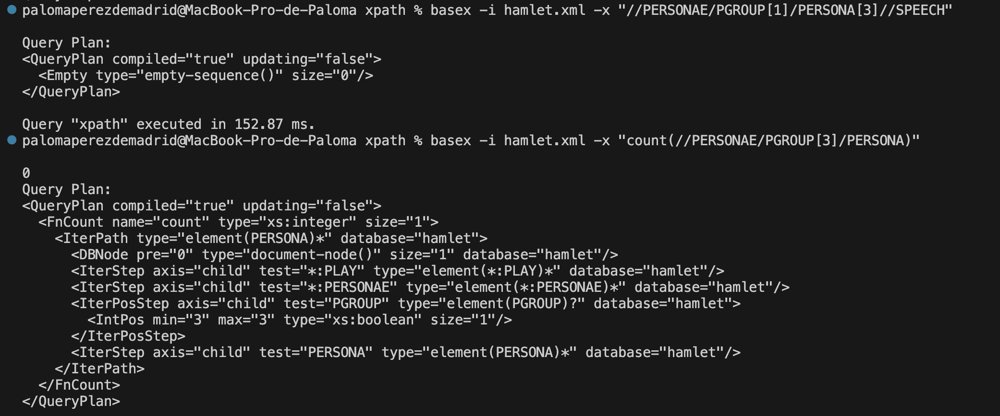

# XPath

## Ejercicio 1

Usa XPath para responder a las siguientes preguntas sobre el archivo `hamlet.xml`:

```bash
basex -i hamlet "//ACT[TITLE='ACT II']//SCENE/TITLE"
```

 
2. ¿Cuántas veces habla Hamlet?  
Contar cuántos diálogos (SPEECH) tienen como hablante a HAMLET.
```bash
basex -i hamlet.xml -x "count(//SPEAKER[text() = 'HAMLET']/parent::SPEECH)"
```


3. El texto de las líneas que contengan la palabra "king" 
```bash
basex -i hamlet.xml -x "//LINE[contains(., 'king')]"
```


4. El segundo diálogo (`speech`) de Bernardo en el tercer acto  

```bash
basex -i hamlet.xml -x "//ACT[TITLE='ACT III']//SPEECH[SPEAKER='BERNARDO'][2]"
```

> Nota: `[2]` selecciona el segundo diálogo de Bernardo en el acto III.

> Nota: Parece que no hay ningún resultado. Si miramos todas las veces que habla Bernardo en el tercer acto nos sale que cero.


5. Número de líneas de cada diálogo (`speech`)  
```bash
basex -i hamlet.xml -x "//SPEECH/count(LINE)"
```


* El primer diálogo tiene 2 líneas.
* El segundo diálogo tiene 1 línea.
* El tercer diálogo tiene 10 líneas.
* Y así sucesivamente.


6. Número de líneas del diálogo (`speech`) con más líneas 
```bash
basex -i hamlet.xml -x "max(//SPEECH/count(LINE))"
```


7. Todos los diálogos (`speech`) de la tercera `PERSONA` del primer `PGROUP` dentro de `PERSONAE`

```bash
basex -i hamlet.xml -x "//PERSONAE/PGROUP[1]/PERSONA[3]//SPEECH"
```

Esta consulta hace lo siguiente:

* Selecciona el primer grupo de personajes dentro de `PERSONAE` (`PGROUP[1]`).
* Luego, selecciona la tercera `PERSONA` dentro de ese grupo (`PERSONA[3]`).
* Finalmente, obtiene todos los diálogos (`SPEECH`) asociados a esa persona.



Parece que no hay un resultado.


